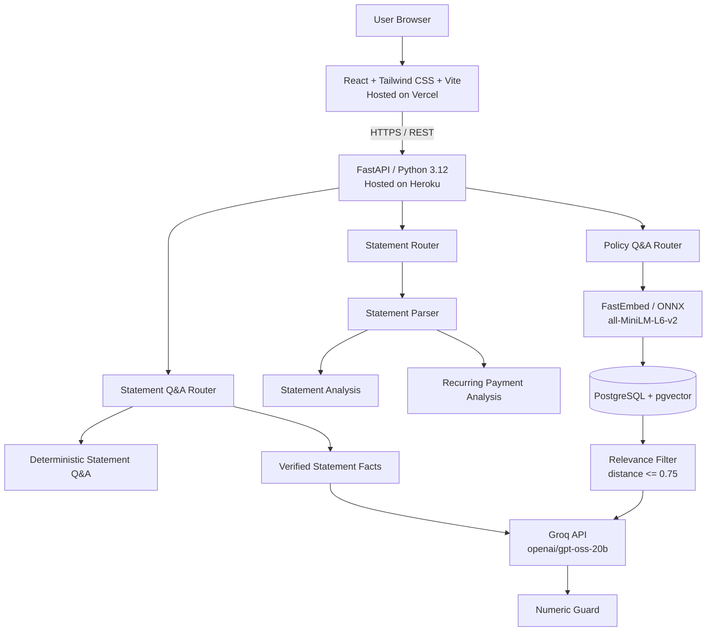
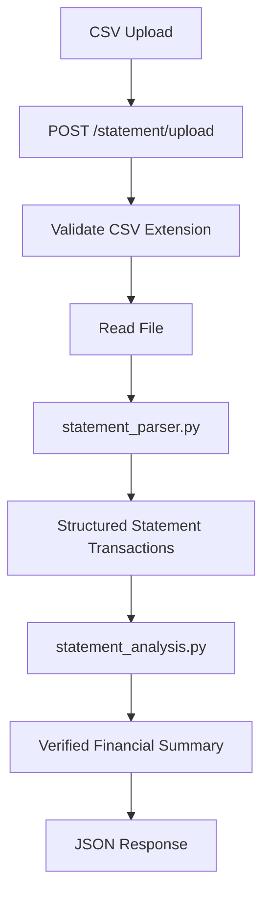
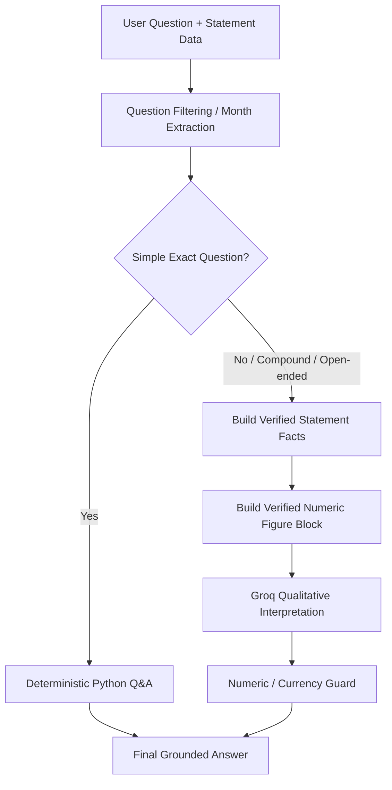
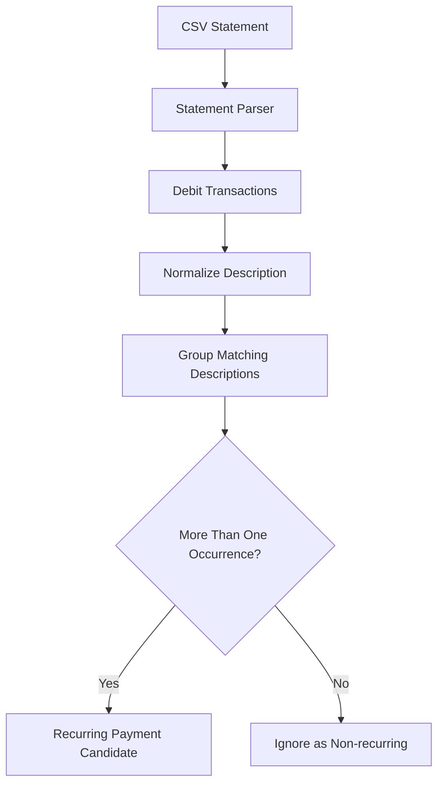
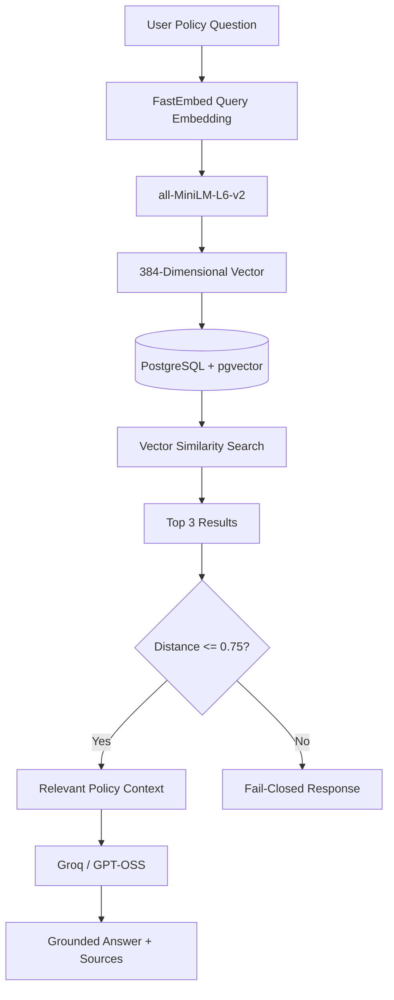

# ABL Customer Statement Intelligence Suite — Architecture

> **Document:** System Architecture
> **Application:** ABL Customer Statement Intelligence Suite — App 1 of 2
> **Developer:** Daniyal Saqib
> **Program:** Allied Bank Internship Program (ABIP)
> **Sponsor / Reviewer:** Sir Affan Wahid
> **Architecture review date:** 16 September 2026
> **Application status:** Production Functional — documentation and handover preparation in progress

---

# 1. Architecture Summary

The ABL Customer Statement Intelligence Suite uses a:

> **Layered client-server architecture with a modular FastAPI backend, deterministic financial-processing services, an external LLM integration, and a Retrieval-Augmented Generation (RAG) subsystem.**

The backend is implemented as a **modular monolith**.

It is **not a microservices architecture**.

The frontend and backend are deployed independently, but the backend application itself runs as one FastAPI application containing logically separated routers, services, models, and database modules.

At a high level:

```text
User Browser
     ↓
React + Tailwind CSS + Vite
     ↓
Vercel
     ↓
HTTPS / REST API
     ↓
FastAPI / Python 3.12
     ↓
Heroku
     ↓
Application Services
     ├── Statement Intelligence
     ├── Recurring Payment Analysis
     ├── Statement Q&A
     └── Policy RAG
```

---

# 2. Architecture Goals

The architecture was designed around the following goals:

- Keep exact financial calculations deterministic.
- Use the LLM only where natural-language interpretation is useful.
- Prevent the LLM from becoming the source of truth for financial arithmetic.
- Keep the frontend and backend independently deployable.
- Keep backend responsibilities modular without introducing unnecessary microservices complexity.
- Use local/free embeddings for semantic search.
- Keep vector search inside PostgreSQL rather than operating a separate vector database.
- Fail closed when policy retrieval does not provide sufficiently relevant context.
- Avoid using live customer data or confidential internal banking information.
- Keep the deployment lightweight enough for the selected cloud environment.

---

# 3. Architecture Classification

## 3.1 Client–Server Architecture

The browser acts as the client.

The React application communicates with the FastAPI backend through HTTP REST endpoints.

```text
Client
  ↓
React Web Application
  ↓
HTTPS REST Requests
  ↓
FastAPI Server
  ↓
Processing / Retrieval / LLM
  ↓
JSON Response
  ↓
React UI
```

---

## 3.2 Layered Architecture

The application is logically divided into layers:

```text
Presentation Layer
        ↓
API / Routing Layer
        ↓
Service / Business Logic Layer
        ↓
Data / Retrieval Layer
        ↓
External AI Provider
```

Each layer has a different responsibility.

---

## 3.3 Modular Monolith

The FastAPI backend is deployed as a single application, but its responsibilities are separated into modules.

Main backend structure:

```text
backend/
└── app/
    ├── main.py
    ├── db/
    │   └── policy_vector_store.py
    ├── models/
    │   └── statement.py
    ├── routers/
    │   ├── statements.py
    │   ├── statement_qa.py
    │   └── policy_qa.py
    └── services/
        ├── statement_parser.py
        ├── statement_analysis.py
        ├── statement_facts.py
        ├── statement_qa_deterministic.py
        ├── statement_qa_filter.py
        ├── subscription_analysis.py
        ├── embedding_service.py
        └── llm_service.py
```

This structure provides separation of concerns while keeping deployment simple.

---

# 4. Overall Production Architecture



---

# 5. Deployment Architecture

The frontend and backend are deployed separately.

```text
                        INTERNET
                           │
              ┌────────────┴────────────┐
              │                         │
              ▼                         ▼
          Vercel                    Heroku
     React/Vite Frontend       FastAPI Backend
              │                         │
              │       HTTPS REST        │
              └────────────────────────►│
                                        │
                           ┌────────────┴─────────────┐
                           │                          │
                           ▼                          ▼
                     Groq API                 PostgreSQL
                                             + pgvector
```

## Frontend

Hosted on:

```text
Vercel
```

Production application:

```text
https://statement-intelligence-suite-abl.vercel.app
```

Technology:

```text
React.js
Tailwind CSS
Vite
```

---

## Backend

Hosted on:

```text
Heroku
```

Technology:

```text
FastAPI
Python 3.12
```

Production backend:

```text
https://pure-temple-45004-09958cbb6652.herokuapp.com
```

Health endpoint:

```http
GET /health
```

---

# 6. Presentation Layer

The frontend is implemented using React.js.

Main source files currently include:

```text
frontend/src/App.jsx
frontend/src/App.css
frontend/src/index.css
frontend/src/main.jsx
```

Responsibilities include:

- Statement upload interface
- Statement analysis display
- Natural-language statement Q&A interface
- Recurring-payment analysis display
- Policy Assistant interface
- Source-link presentation
- API request handling
- Loading and error-state presentation

The frontend does not perform authoritative financial calculations.

Those calculations belong to the backend.

---

# 7. API / Routing Layer

FastAPI provides the HTTP API.

The central application entry point is:

```text
backend/app/main.py
```

It registers the routers and configures CORS.

Main routers:

```text
backend/app/routers/statements.py
backend/app/routers/statement_qa.py
backend/app/routers/policy_qa.py
```

---

## Main Endpoints

### Health

```http
GET /health
```

Purpose:

```text
Backend availability / health check
```

---

### Statement Upload

```http
POST /statement/upload
```

Purpose:

```text
Parse a synthetic CSV bank statement and return deterministic analysis.
```

---

### Statement Q&A

```http
POST /statement/ask
```

Purpose:

```text
Answer questions about supplied statement data.
```

---

### Recurring Payment Analysis

```http
POST /statement/subscriptions
```

Purpose:

```text
Detect repeated outgoing-payment descriptions and return recurring-payment candidates.
```

---

### Policy Assistant

```http
POST /policy/ask
```

Purpose:

```text
Answer questions using retrieved public-policy context.
```

---

# 8. Statement Upload Architecture

The statement-upload workflow is deterministic.



The endpoint:

```text
POST /statement/upload
```

calls:

```text
parse_statement_csv()
```

and then:

```text
analyze_statement()
```

The LLM is not required for this workflow.

---

# 9. Statement Parsing Layer

The statement parser converts CSV data into structured transaction records.

Service:

```text
backend/app/services/statement_parser.py
```

Its responsibility is to convert user-supplied CSV data into a normalized format that can be safely consumed by downstream services.

The parser supports the demonstration statement formats used by the project.

Examples include:

```text
date
description
debit
credit
balance
```

and more realistic variants such as:

```text
Date
Description
Debit (Rs)
Credit (Rs)
Balance (Rs)
```

The synthetic demonstration data can also include values such as:

```text
Rs 5,420.00
Rs 95,000.00
Rs 612.75
```

---

# 10. Statement Analysis Architecture

After parsing, statement analysis is performed deterministically in Python.

Service:

```text
backend/app/services/statement_analysis.py
```

Typical values include:

- Transaction count
- Total debit
- Total credit
- Opening balance
- Closing balance

Additional verified facts are generated through:

```text
backend/app/services/statement_facts.py
```

These can include:

- Debit count
- Credit count
- Monthly spending
- Monthly credits
- Spending by description
- Largest debit
- Largest credit

The central architectural rule is:

> **Python owns financial arithmetic.**

The LLM is never treated as the authoritative calculator.

---

# 11. Statement Q&A Architecture

Statement Q&A uses a **hybrid deterministic + LLM architecture**.

This is different from sending the entire statement directly to the LLM.



---

# 12. Deterministic Statement Q&A

Simple exact questions can be answered without calling the LLM.

Service:

```text
backend/app/services/statement_qa_deterministic.py
```

Examples include questions such as:

```text
How much did I spend?
```

or other supported exact financial queries.

The deterministic route improves:

- Accuracy
- Predictability
- Latency
- Financial safety

---

# 13. Open-Ended Statement Q&A

Questions requiring interpretation are allowed to use Groq.

Examples include:

```text
Summarize my statement.
```

```text
Compare the months and tell me what stands out.
```

```text
Give me an overview of my spending patterns.
```

However, before the LLM is called:

1. Python calculates verified statement facts.
2. Relevant transactions are selected.
3. Backend instructions explicitly define those facts as authoritative.

Groq receives grounded context rather than being asked to perform unrestricted financial analysis.

---

# 14. Compound Question Handling

The backend detects questions that contain multiple requirements or interpretive wording.

Examples:

```text
How much did I spend and what was my closing balance?
```

```text
Tell me my total spending and what stands out.
```

Such questions are prevented from being prematurely answered by a single deterministic metric.

Instead, they can continue into the verified-facts pipeline.

---

# 15. Numeric Guard

A dedicated safety mechanism protects financial figures returned to the user.

The LLM is instructed not to independently produce numeric financial values when verified Python figures are being supplied.

Conceptually:

```text
Verified Python Figures
        +
LLM Qualitative Commentary
        ↓
Check LLM output
        ↓
Contains unexpected numbers / currency?
       / \
     Yes  No
      │    │
      ▼    ▼
Discard   Combine
LLM       safely
numbers
```

If LLM commentary contains numeric or currency content when the backend owns the verified figures, that commentary can be discarded.

Therefore:

> **Financial numbers come from deterministic code, not generated reasoning.**

---

# 16. Month-Specific Statement Q&A

The backend can identify month/year references in a user question.

Services include:

```text
backend/app/services/statement_qa_filter.py
```

The flow becomes:

```text
Question
   ↓
Extract month / year
   ↓
Filter statement transactions
   ↓
Operate only on selected transactions
   ↓
Deterministic answer
        OR
Verified facts + grounded LLM interpretation
```

This prevents transactions from unrelated months from contaminating the answer.

---

# 17. Recurring Payment Architecture

Recurring-payment analysis is deterministic.

Endpoint:

```http
POST /statement/subscriptions
```

Service:

```text
backend/app/services/subscription_analysis.py
```

Workflow:



The module returns **candidates**, not confirmed subscriptions.

For example:

```text
K-Electric Bill Payment
PTCL Internet Bill
```

may be identified when each description appears multiple times.

A repeated merchant does not automatically prove a subscription.

That limitation is intentional.

---

# 18. Policy Assistant Architecture

The Policy Assistant uses Retrieval-Augmented Generation.

It does not simply ask the LLM to answer from general model knowledge.

The architecture is:



---

# 19. Embedding Layer

Embedding service:

```text
backend/app/services/embedding_service.py
```

Embedding runtime:

```text
FastEmbed
ONNX Runtime
```

Embedding model:

```text
sentence-transformers/all-MiniLM-L6-v2
```

Vector dimensions:

```text
384
```

The embedding model is lazy-loaded.

This means the embedding runtime is initialized only when the Policy Assistant requires it.

That avoids paying the embedding-runtime memory cost during backend operations that do not use RAG.

---

# 20. Why FastEmbed / ONNX Is Used

The project originally used the heavier SentenceTransformers/PyTorch runtime.

During production optimization, that path contributed substantial memory overhead on Heroku.

Development measurements showed approximately:

```text
SentenceTransformers path: first embedding ≈ 443 MB
FastEmbed path:            first embedding ≈ 203 MB
```

The architecture therefore migrated to FastEmbed / ONNX while retaining the MiniLM 384-dimensional embedding model.

The change reduced the embedding runtime footprint and was more suitable for the selected deployment environment.

---

# 21. Vector Store Architecture

Vector-store implementation:

```text
backend/app/db/policy_vector_store.py
```

Database:

```text
PostgreSQL
```

Vector extension:

```text
pgvector
```

Table:

```text
policy_documents
```

Conceptual structure:

```text
policy_documents
├── id
├── title
├── source
├── content
└── embedding vector(384)
```

Vector similarity uses PostgreSQL + pgvector rather than a separate vector database.

---

# 22. Policy Retrieval

When the user submits a policy question:

1. The question is converted into a 384-dimensional query embedding.
2. PostgreSQL compares it against stored policy embeddings.
3. Results are ordered by vector distance.
4. Up to three candidate chunks are returned.
5. The application applies a relevance threshold.

Current threshold:

```text
distance <= 0.75
```

Smaller distance indicates a stronger semantic match.

---

# 23. Policy Fail-Closed Behavior

If no retrieved document passes the relevance threshold, the system does not call the LLM with weak or unrelated policy context.

It instead returns:

```text
I could not find relevant information in the available Allied Bank public policy documents.
```

This architecture reduces the risk of fabricated policy responses.

---

# 24. Policy LLM Grounding

If sufficiently relevant policy context exists, only that retrieved context is included in the prompt.

Groq is instructed to:

- Use only retrieved context.
- Avoid outside policy knowledge.
- Avoid inventing policy information.
- Avoid inventing source URLs.
- State when the available context is insufficient.

The response includes source metadata from the retrieved documents.

---

# 25. Public Policy Corpus

The current demonstration corpus contains seven public policy/document chunks.

```text
1. Account and Electronic Banking Terms
2. Changes to Terms and Conditions
3. Financial Consumer Protection Framework
4. Customer Complaints and Confidentiality
5. Unclaimed Deposit Refund
6. Unclaimed Deposit Required Documents
7. Schedule of Charges
```

The Policy Assistant does not use confidential internal Allied Bank documents.

---

# 26. LLM Integration Layer

LLM integration is isolated inside:

```text
backend/app/services/llm_service.py
```

Provider:

```text
Groq
```

Model:

```text
openai/gpt-oss-20b
```

Production configuration:

```text
reasoning_effort = low
temperature = 0.0
max_completion_tokens = 1600
timeout = 15 seconds
max_retries = 0
```

The rest of the application does not need to know the implementation details of the Groq SDK.

This isolates provider-specific logic.

---

# 27. Why Groq Is Used

An earlier application version used Gemini.

Production testing exposed availability and free-tier quota reliability issues.

The architecture was therefore migrated to:

```text
Groq
+
openai/gpt-oss-20b
```

The important architectural principle is not the specific vendor.

The important design choice is that the provider is isolated behind:

```text
llm_service.py
```

This makes future provider changes easier than scattering provider-specific calls throughout the application.

---

# 28. Database Responsibilities

PostgreSQL is used primarily for the Policy Assistant.

It stores:

- Policy title
- Source URL
- Policy/document content
- 384-dimensional embedding vectors

The uploaded synthetic bank statement is **not persisted into the policy vector database**.

Statement processing occurs as part of the active request workflow.

---

# 29. Data Flow Boundaries

There are two separate major data paths.

## Statement Path

```text
Synthetic CSV
    ↓
FastAPI
    ↓
Parser
    ↓
Python services
    ↓
Optional grounded Groq interpretation
    ↓
Response
```

## Policy Path

```text
Policy Question
    ↓
FastAPI
    ↓
Embedding
    ↓
PostgreSQL + pgvector
    ↓
Relevant public context
    ↓
Groq
    ↓
Answer + sources
```

Statement data and policy-vector data serve different purposes.

---

# 30. Security and Data-Safety Boundaries

The project has explicit demonstration boundaries.

The architecture does not connect to:

- Live Allied Bank customer accounts
- Core-banking systems
- Production customer transaction systems
- Confidential internal Allied Bank documentation

Statement testing uses synthetic/local data.

Sensitive configuration is stored through environment variables.

Examples:

```text
GROQ_API_KEY
DATABASE_URL
GROQ_MODEL
```

Secrets must not be exposed through frontend Vite variables.

---

# 31. CORS Boundary

FastAPI configures Cross-Origin Resource Sharing for the approved frontend origins.

Development origins include:

```text
http://localhost:5173
http://127.0.0.1:5173
```

Production frontend:

```text
https://statement-intelligence-suite-abl.vercel.app
```

This allows the React frontend to communicate with FastAPI.

---

# 32. Reliability Architecture

Several production-hardening decisions are built into the architecture.

| Risk | Architectural Mitigation |
|---|---|
| Incorrect LLM arithmetic | Python owns authoritative financial calculations |
| Compound questions | Open-ended detection prevents premature deterministic short-circuiting |
| Incorrect numeric commentary | Numeric/currency guard |
| LLM provider failure | Controlled API error handling |
| Weak RAG matches | Distance threshold |
| Unsupported policy question | Fail-closed policy response |
| Heroku memory pressure | FastEmbed / ONNX |
| Duplicate policy reseeding | Transactional replacement workflow |
| Statement format differences | Parser validation and aliases |
| Excess frontend complexity | React/Vite SPA rather than Next.js |

---

# 33. Frontend Performance Architecture

The frontend remains deliberately lightweight.

Production characteristics measured during Lighthouse testing included:

```text
JavaScript ≈ 65 KB gzip
CSS        ≈ 6 KB gzip
```

Repeated production Lighthouse runs produced performance scores of:

```text
89
95
93
```

with approximately:

```text
FCP: 1.2–1.7 s
LCP: 1.2–1.7 s
TBT: 10–20 ms
CLS: 0
```

This supports the decision not to introduce unnecessary frontend architectural complexity.

---

# 34. SEO Architecture

SEO support is handled at the frontend/document level.

Production implementation includes:

- Descriptive HTML title
- Meta description
- Robots metadata
- Canonical URL
- Open Graph metadata
- Twitter large-image metadata
- SoftwareApplication structured data
- `robots.txt`
- `sitemap.xml`
- Custom favicon
- Social preview image

Production Lighthouse SEO score:

```text
100
```

---

# 35. Why This Is Not a Microservices Architecture

The project has multiple functional modules, but they all run inside the same FastAPI backend deployment.

For example:

```text
Statement Router
Statement Q&A Router
Policy Router
```

are modules inside one application.

They do not have:

- Separate independently deployed backend services
- Separate service runtimes
- Independent service databases
- Service-to-service network communication
- Independent scaling boundaries

Therefore the correct description is:

> **Modular monolith**

rather than:

> Microservices

This design is appropriate for the scope of the internship application because it provides logical separation without unnecessary distributed-system complexity.

---

# 36. Why the Frontend and Backend Are Separate

The architecture separates presentation from backend processing.

Frontend:

```text
Vercel
React
Vite
Tailwind
```

Backend:

```text
Heroku
FastAPI
Python
```

Advantages include:

- Independent frontend deployment
- Independent backend deployment
- Clear REST boundary
- Backend secrets remain server-side
- React remains focused on presentation
- Python remains responsible for financial and AI logic

This separation does not make the backend a microservices system.

---

# 37. Key Architectural Principle

The most important architectural decision in the application is:

```text
Deterministic systems calculate.
LLMs explain.
Retrieval grounds policy answers.
```

For statement intelligence:

```text
Python → source of truth
Groq  → interpretation layer
```

For policy intelligence:

```text
pgvector retrieval → source context
Groq               → language-generation layer
```

---

# 38. Architecture in One Sentence

> The system is a layered client-server web application where a React/Vite frontend on Vercel communicates with a modular FastAPI backend on Heroku; Python performs authoritative financial processing, while Groq handles grounded language generation and the Policy Assistant uses FastEmbed with PostgreSQL/pgvector for RAG.

---

# 39. 30-Second Architecture Explanation

A concise verbal explanation is:

> The application uses a layered client-server architecture. The React and Vite frontend is hosted on Vercel and communicates through REST APIs with a FastAPI backend on Heroku. The backend is a modular monolith with separate routers and services. Statement calculations and recurring-payment detection are deterministic Python logic. For open-ended statement questions, Python first calculates verified facts and Groq only provides grounded interpretation. The Policy Assistant uses RAG with FastEmbed, MiniLM embeddings and PostgreSQL with pgvector before sending relevant context to Groq.

---

# 40. Architecture Status

As of 16 September 2026:

```text
Frontend Architecture              COMPLETE
Backend Modular Architecture       COMPLETE
Deterministic Statement Pipeline   COMPLETE
Recurring Payment Pipeline         COMPLETE
Statement Hybrid Q&A               COMPLETE
Policy RAG Pipeline                COMPLETE
Production Deployment              COMPLETE
SEO Hardening                      COMPLETE
Performance Validation             COMPLETE
Architecture Documentation         COMPLETE
Final Handover Documentation       IN PROGRESS
```

The application remains within its MVP and internship-demonstration boundaries while all three primary functional modules are production functional.
