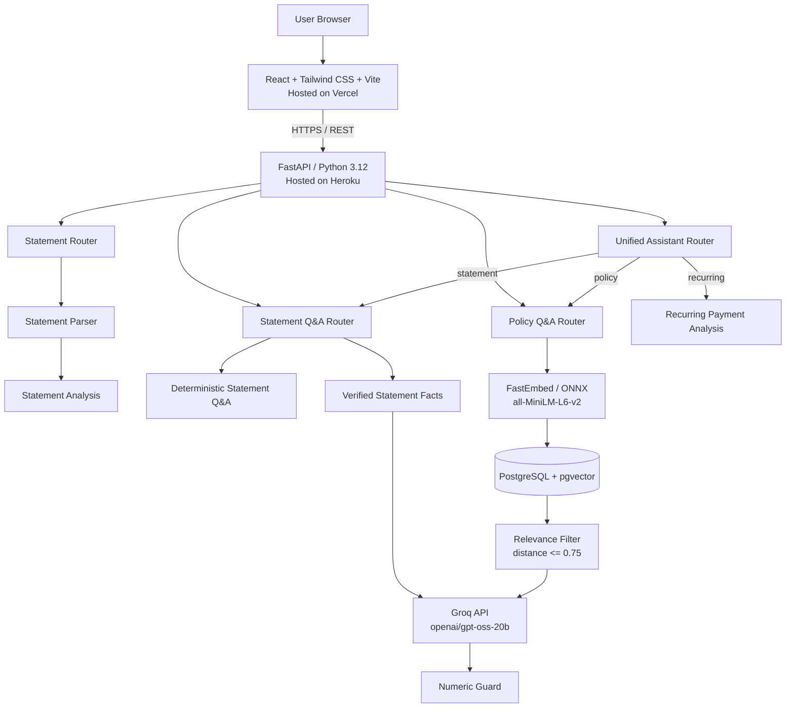
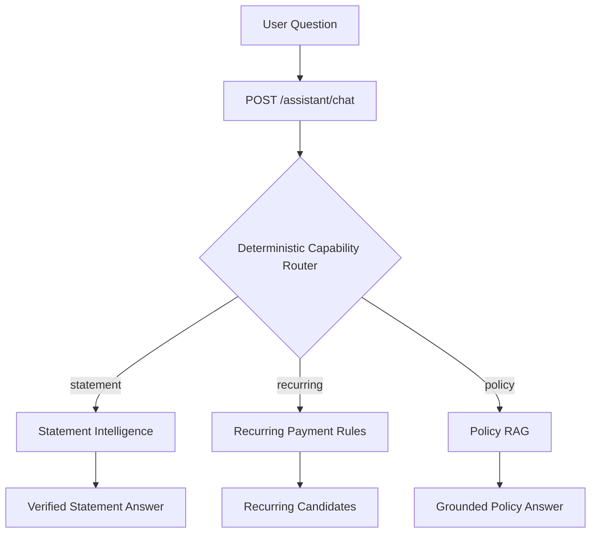
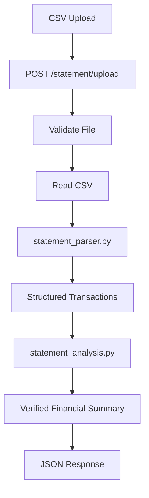
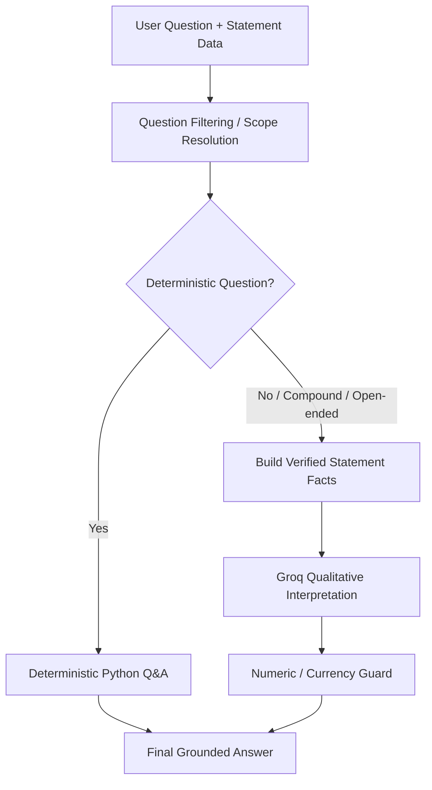
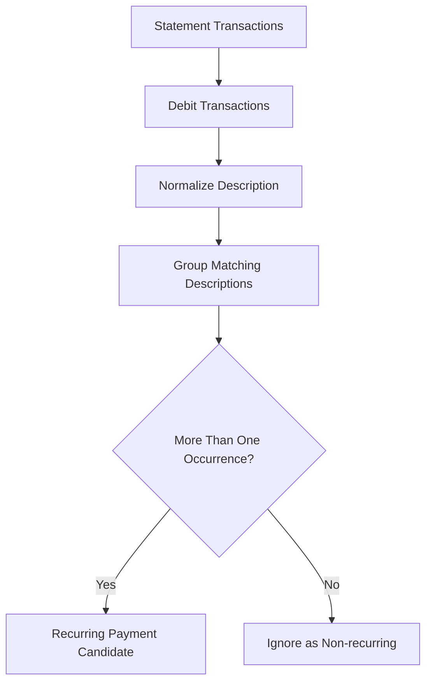
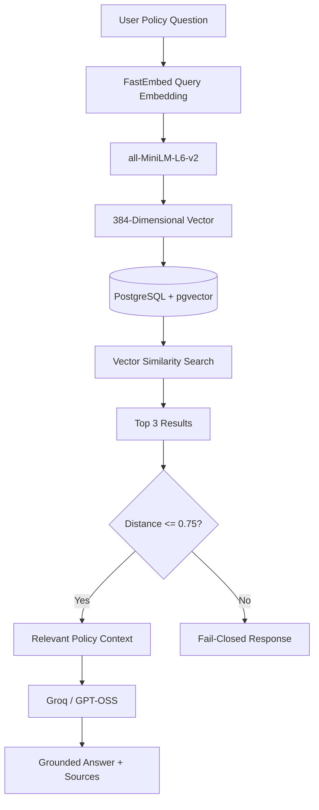

# ABL Customer Statement Intelligence Suite — Architecture

> **Document:** System Architecture
> **Application:** ABL Customer Statement Intelligence Suite
> **Developer:** Daniyal Saqib
> **Program:** Allied Bank Internship Program (ABIP)
> **Sponsor / Reviewer:** Sir Affan Wahid
> **Architecture review date:** 22 September 2026
> **Application status:** Production Functional — final documentation and handover preparation in progress

---

# 1. Architecture Summary

The ABL Customer Statement Intelligence Suite uses a:

> **Layered client-server architecture with a modular FastAPI backend, deterministic financial-processing services, a unified conversational orchestration layer, an external LLM integration, and a Retrieval-Augmented Generation (RAG) subsystem.**

The backend is implemented as a **modular monolith**.

It is **not a microservices architecture**.

The production frontend presents the system as one conversational banking-intelligence workspace. Internally, the backend routes each question into one of three specialized capabilities:

```text
Verified Statement Intelligence
Deterministic Recurring-Payment Detection
Grounded Public-Policy RAG
```

The frontend and backend are deployed independently, but the backend application itself runs as one FastAPI application containing logically separated routers, services, models, and database modules.

At a high level:

```text
User Browser
     |
     v
React + Tailwind CSS + Vite
     |
     v
Vercel
     |
     v
HTTPS / REST API
     |
     v
FastAPI / Python 3.12
     |
     v
Unified Assistant Router
     |
     +----------------+----------------+
     |                |                |
     v                v                v
 Statement        Recurring          Policy
 Intelligence     Payment Rules      RAG
     |                |                |
     v                v                v
Verified Python   Python Rules     pgvector
Facts / Guard                      Retrieval
     |                |                |
     +----------------+----------------+
                      |
                      v
                   Groq
                      |
                      v
                Final Response
```

---

# 2. Architecture Goals

The architecture is designed around the following goals:

- Keep exact financial calculations deterministic.
- Use the LLM only where natural-language interpretation is useful.
- Prevent the LLM from becoming the source of truth for financial arithmetic.
- Present multiple banking-intelligence capabilities through one conversational UX.
- Keep capability routing deterministic rather than LLM-controlled.
- Support safe multi-turn statement follow-ups.
- Avoid treating previous assistant messages as authoritative financial truth.
- Keep recurring-payment detection deterministic.
- Ground public-policy answers in retrieved public Allied Bank context.
- Keep the frontend and backend independently deployable.
- Keep backend responsibilities modular without introducing unnecessary microservices complexity.
- Use local/free embeddings for semantic search.
- Keep vector search inside PostgreSQL rather than operating a separate vector database.
- Fail closed when policy retrieval does not provide sufficiently relevant context.
- Avoid using live customer data or confidential internal banking information.
- Keep the deployment lightweight enough for the selected cloud environment.

---

# 3. Architecture Classification

## 3.1 Client–Server Architecture

The browser acts as the client.

The React application communicates with the FastAPI backend through HTTP REST endpoints.

```text
Client
  |
  v
React Web Application
  |
  v
HTTPS REST Requests
  |
  v
FastAPI Server
  |
  v
Processing / Routing / Retrieval / LLM
  |
  v
JSON Response
  |
  v
React UI
```

---

## 3.2 Layered Architecture

The application is logically divided into layers:

```text
Presentation Layer
        |
        v
API / Routing Layer
        |
        v
Service / Business Logic Layer
        |
        v
Data / Retrieval Layer
        |
        v
External AI Provider
```

Each layer has a different responsibility.

---

## 3.3 Modular Monolith

The FastAPI backend is deployed as a single application, but its responsibilities are separated into modules.

Main backend structure:

```text
backend/
└── app/
    ├── main.py
    ├── db/
    │   └── policy_vector_store.py
    ├── models/
    │   └── statement.py
    ├── routers/
    │   ├── assistant.py
    │   ├── statements.py
    │   ├── statement_qa.py
    │   └── policy_qa.py
    └── services/
        ├── statement_parser.py
        ├── statement_analysis.py
        ├── statement_facts.py
        ├── statement_qa_deterministic.py
        ├── statement_qa_filter.py
        ├── subscription_analysis.py
        ├── embedding_service.py
        └── llm_service.py
```

This structure provides separation of concerns while keeping deployment simple.

---

# 4. Overall Production Architecture



---

# 5. Deployment Architecture

The frontend and backend are deployed separately.

```text
                        INTERNET
                           |
              +------------+------------+
              |                         |
              v                         v
          Vercel                    Heroku
     React/Vite Frontend       FastAPI Backend
              |                         |
              |       HTTPS REST        |
              +------------------------>|
                                        |
                           +------------+-------------+
                           |                          |
                           v                          v
                     Groq API                 PostgreSQL
                                             + pgvector
```

## Frontend

Hosted on:

```text
Vercel
```

Production application:

```text
https://statement-intelligence-suite-abl.vercel.app
```

Technology:

```text
React.js
Tailwind CSS
Vite
```

---

## Backend

Hosted on:

```text
Heroku
```

Technology:

```text
FastAPI
Python 3.12
```

Production backend:

```text
https://pure-temple-45004-09958cbb6652.herokuapp.com
```

Current verified release:

```text
Heroku release v17
Commit a04d7b1
```

Health endpoint:

```http
GET /health
```

---

# 6. Presentation Layer

The frontend is implemented using React.js.

Main source files currently include:

```text
frontend/src/App.jsx
frontend/src/index.css
frontend/src/main.jsx
```

Responsibilities include:

- Synthetic statement upload
- Runtime demo-statement generation
- Verified statement-analysis presentation
- Unified conversational assistant workspace
- Multi-turn statement follow-ups
- Recurring-payment candidate presentation
- Policy-source presentation
- Assistant provenance presentation
- Loading and error-state presentation

The frontend does not perform authoritative financial calculations.

Those calculations belong to the backend.

---

# 7. API / Routing Layer

FastAPI provides the HTTP API.

The central application entry point is:

```text
backend/app/main.py
```

It registers routers and configures CORS.

Main routers:

```text
backend/app/routers/assistant.py
backend/app/routers/statements.py
backend/app/routers/statement_qa.py
backend/app/routers/policy_qa.py
```

The unified assistant router is a thin orchestration layer over the existing capabilities.

It does not duplicate financial arithmetic or policy retrieval logic.

---

## Main Endpoints

### Unified Assistant

```http
POST /assistant/chat
```

Purpose:

```text
Provide one conversational entry point for statement intelligence,
recurring-payment detection, and public-policy RAG.
```

Request fields include:

```text
question
statement_data
conversation_history
```

Response metadata includes:

```text
capability
method
answer
sources
structured_data
```

Current method values include:

```text
verified_statement_intelligence
deterministic_recurring_rules
policy_rag
```

---

### Health

```http
GET /health
```

Purpose:

```text
Backend availability / health check
```

---

### Statement Upload

```http
POST /statement/upload
```

Purpose:

```text
Parse a synthetic CSV bank statement and return deterministic analysis.
```

---

### Backward-Compatible Statement Q&A

```http
POST /statement/ask
```

Purpose:

```text
Answer questions about supplied statement data.
```

---

### Backward-Compatible Recurring Payment Analysis

```http
POST /statement/subscriptions
```

Purpose:

```text
Detect repeated outgoing-payment descriptions and return recurring-payment candidates.
```

---

### Backward-Compatible Policy Assistant

```http
POST /policy/ask
```

Purpose:

```text
Answer questions using retrieved public-policy context.
```

---

# 8. Unified Assistant Architecture

The production frontend uses one conversational endpoint for three internal capabilities.



The router does **not** use an LLM to choose a capability.

Routing is intentionally deterministic so that:

- Financial questions remain predictable.
- Recurring-payment logic remains rule based.
- Policy questions enter the RAG path only when strong policy signals exist.
- A loaded statement remains the default context for ordinary personal statement questions.

---

# 9. Capability Routing Rules

The unified router evaluates normalized user language.

Strong policy language is checked first.

Examples include:

```text
policy
terms and conditions
consumer protection
customer complaint
complaint procedure
unclaimed deposit
required documents
deceased customer
succession certificate
schedule of charges
```

Recurring-payment language is checked second.

Examples include:

```text
recurring
subscription
repeated payments
payments keep repeating
same merchant
monthly payments
payments every month
```

If neither capability is strongly signaled and statement data is loaded, the request defaults to statement intelligence.

If no statement is loaded and the request does not qualify as policy, the statement path returns the controlled requirement to analyze a synthetic statement first.

---

# 10. Statement Upload Architecture

The statement-upload workflow is deterministic.



The endpoint calls:

```text
parse_statement_csv()
```

and then:

```text
analyze_statement()
```

The LLM is not required for this workflow.

---

# 11. Statement Parsing Layer

The statement parser converts CSV data into structured transaction records.

Service:

```text
backend/app/services/statement_parser.py
```

Its responsibility is to convert user-supplied synthetic CSV data into a normalized format that downstream services can safely consume.

Core transaction fields are:

```text
date
description
debit
credit
balance
```

The parser also handles supported header aliases and demonstration formats.

The API applies limits and validation before downstream processing.

Current input hardening includes controls for:

- CSV upload size
- Maximum statement rows
- Required fields
- Extra row fields
- Description length
- Valid dates
- Finite numeric values
- Supported CSV structure

---

# 12. Statement Analysis Architecture

After parsing, statement analysis is performed deterministically in Python.

Service:

```text
backend/app/services/statement_analysis.py
```

Typical values include:

- Transaction count
- Total debit
- Total credit
- Opening balance
- Closing balance

Additional verified facts are generated through:

```text
backend/app/services/statement_facts.py
```

These include:

- Debit count
- Credit count
- Monthly spending
- Monthly credits
- Spending by description
- Largest debit
- Largest credit

The central architectural rule is:

> **Python owns financial arithmetic.**

The LLM is never treated as the authoritative calculator.

---

# 13. Statement Q&A Architecture

Statement Q&A uses a **hybrid deterministic + LLM architecture**.

This is different from sending the entire statement directly to the LLM and asking it to calculate answers.



Simple exact questions can be answered without calling the LLM.

Open-ended or compound questions can continue through the verified-facts + LLM path.

---

# 14. Deterministic Statement Q&A

Service:

```text
backend/app/services/statement_qa_deterministic.py
```

Examples of deterministic financial intents include:

```text
How much did I spend?
How much money went out?
What was my total expenditure?
How much money came in?
What was my closing balance?
What was my largest debit?
How many debit transactions were there?
```

The deterministic route improves:

- Accuracy
- Predictability
- Latency
- Financial safety

Shared financial-language phrase groups are used so that the deterministic calculator and numeric guard recognize the same supported intent vocabulary.

---

# 15. Natural Financial-Language Handling

The system does not require users to phrase financial questions in one exact way.

Supported language includes natural alternatives such as:

```text
total spending
total spend
expenditure
outflows
money went out
credits
income
inflows
money came in
```

This vocabulary is shared across statement-intelligence logic so that equivalent financial intents are handled consistently.

---

# 16. Open-Ended Statement Q&A

Questions requiring interpretation are allowed to use Groq.

Examples include:

```text
Summarize my statement.
```

```text
Compare the months and tell me what stands out.
```

```text
Give me an overview of my spending patterns.
```

Before the LLM is called:

1. Python calculates verified statement facts.
2. Relevant statement rows are selected.
3. Prompt trust boundaries identify transaction descriptions and user text as untrusted input.
4. Verified backend facts are identified as authoritative.

Groq therefore receives grounded context rather than being asked to perform unrestricted financial arithmetic.

---

# 17. Compound Question Handling

The backend detects questions that contain multiple requirements or interpretive wording.

Examples:

```text
How much did I spend and what was my closing balance?
```

```text
Tell me my total spending and what stands out.
```

Such questions are prevented from being prematurely answered by a single deterministic metric.

Instead, verified facts can be combined with guarded qualitative interpretation.

---

# 18. Numeric Guard

A dedicated safety mechanism protects financial figures returned to the user.

The LLM is instructed not to independently produce numeric financial values when verified Python figures are being supplied.

Conceptually:

```text
Verified Python Figures
        +
LLM Qualitative Commentary
        |
        v
Check LLM Output
        |
        v
Unexpected numbers / currency?
       / \
     Yes  No
      |    |
      v    v
Discard   Preserve
numeric   safe
commentary commentary
```

Therefore:

> **Financial numbers come from deterministic code, not generated arithmetic.**

---

# 19. Month and Scope Resolution

The backend can identify month/year references in user questions.

Service:

```text
backend/app/services/statement_qa_filter.py
```

The flow becomes:

```text
Question
   |
   v
Extract month / year scope
   |
   v
Filter statement transactions
   |
   v
Operate only on selected rows
   |
   v
Deterministic answer
        OR
Verified facts + grounded LLM interpretation
```

The filtering logic supports explicit and contextual month references while avoiding false interpretation of ordinary language such as modal uses of the word "may".

---

# 20. Multi-Turn Statement Follow-Ups

Statement questions can include recent conversation history.

Model concept:

```text
Current question
+
Current statement rows
+
Recent user/assistant messages
```

Current history is limited to the most recent eight messages.

Example:

```text
User: How much did I spend in August?
Assistant: Your total spending is ...
User: What about July?
```

The backend uses the prior user intent to understand the scope-only follow-up.

However, it does **not** copy the old answer.

It recalculates the July answer from the currently supplied July statement rows.

---

# 21. Cross-Capability Follow-Up Safety

Unified assistant history may contain different capabilities.

Example:

```text
User: How much did I spend in August?
Assistant: ...
User: Which payments keep repeating?
Assistant: ...
User: What about July?
```

A naive history lookup could incorrectly treat the recurring-payment question as the base intent for the July follow-up.

The current implementation avoids that.

The backend scans backward through prior **user** messages and attempts to reapply each candidate question deterministically to the current statement scope.

Messages are skipped when they:

- Are assistant messages
- Are scope-only follow-ups
- Belong to another capability
- Cannot be answered by deterministic statement intelligence

Only a reusable deterministic statement intent is accepted.

Important rule:

> **Assistant history is never trusted as financial truth.**

Current production regression confirms that the example above returns July spending correctly even after the intervening recurring-payment question.

---

# 22. Recurring Payment Architecture

Recurring-payment analysis is deterministic.

Primary production access:

```http
POST /assistant/chat
```

Backward-compatible endpoint:

```http
POST /statement/subscriptions
```

Service:

```text
backend/app/services/subscription_analysis.py
```

Workflow:



The module returns **candidates**, not confirmed subscriptions.

A repeated merchant does not automatically prove a subscription.

That limitation is intentional.

---

# 23. Policy Assistant Architecture

The Policy Assistant uses Retrieval-Augmented Generation.

It does not simply ask the LLM to answer from general model knowledge.

Primary production access:

```http
POST /assistant/chat
```

Backward-compatible endpoint:

```http
POST /policy/ask
```

The architecture is:



---

# 24. Embedding Layer

Embedding service:

```text
backend/app/services/embedding_service.py
```

Embedding runtime:

```text
FastEmbed
ONNX Runtime
```

Embedding model:

```text
sentence-transformers/all-MiniLM-L6-v2
```

Vector dimensions:

```text
384
```

The embedding model is lazy-loaded.

This avoids paying the embedding-runtime memory cost during backend operations that do not use RAG.

---

# 25. Why FastEmbed / ONNX Is Used

The project originally used the heavier SentenceTransformers/PyTorch runtime.

During production optimization, that path contributed substantial memory overhead on Heroku.

Development measurements showed approximately:

```text
SentenceTransformers path: first embedding ≈ 443 MB
FastEmbed path:            first embedding ≈ 203 MB
```

The architecture therefore migrated to FastEmbed / ONNX while retaining the MiniLM 384-dimensional embedding model.

---

# 26. Vector Store Architecture

Vector-store implementation:

```text
backend/app/db/policy_vector_store.py
```

Database:

```text
PostgreSQL
```

Vector extension:

```text
pgvector
```

Table:

```text
policy_documents
```

Conceptual structure:

```text
policy_documents
├── id
├── title
├── source
├── content
└── embedding vector(384)
```

Vector similarity uses PostgreSQL + pgvector rather than a separate vector database.

---

# 27. Policy Retrieval

When the user submits a policy question:

1. The question is converted into a 384-dimensional query embedding.
2. PostgreSQL compares it against stored policy embeddings.
3. Results are ordered by vector distance.
4. Up to three candidate chunks are returned.
5. The application applies a relevance threshold.

Current threshold:

```text
distance <= 0.75
```

Smaller distance indicates a stronger semantic match.

---

# 28. Policy Fail-Closed Behavior

If no retrieved document passes the relevance threshold, the system does not call the LLM with weak or unrelated policy context.

It instead returns a controlled response indicating that relevant information was not found in the available public policy corpus.

This architecture reduces the risk of fabricated policy responses.

---

# 29. Policy LLM Grounding

If sufficiently relevant policy context exists, only that retrieved context is included in the policy prompt.

Groq is instructed to:

- Use only retrieved context.
- Avoid outside policy knowledge.
- Avoid inventing policy information.
- Avoid inventing source URLs.
- State when the available context is insufficient.

The response includes source metadata from retrieved documents.

---

# 30. Public Policy Corpus

The current demonstration corpus contains seven public policy/document chunks.

```text
1. Account and Electronic Banking Terms
2. Changes to Terms and Conditions
3. Financial Consumer Protection Framework
4. Customer Complaints and Confidentiality
5. Unclaimed Deposit Refund
6. Unclaimed Deposit Required Documents
7. Schedule of Charges
```

The Policy Assistant does not use confidential internal Allied Bank documents.

---

# 31. Prompt Trust Boundaries

The system distinguishes authoritative backend facts from untrusted textual input.

Untrusted content includes:

- User questions
- Transaction descriptions
- Retrieved policy text as external content

Authoritative financial content includes:

- Verified Python calculations
- Deterministic statement facts
- Backend-selected statement scope

Prompt construction explicitly separates instructions from untrusted data.

The LLM is not allowed to override backend financial facts.

---

# 32. LLM Integration Layer

LLM integration is isolated inside:

```text
backend/app/services/llm_service.py
```

Provider:

```text
Groq
```

Model:

```text
openai/gpt-oss-20b
```

Production configuration:

```text
reasoning_effort = low
temperature = 0.0
max_completion_tokens = 1600
timeout = 15 seconds
max_retries = 0
```

The rest of the application does not need to know Groq SDK implementation details.

This isolates provider-specific logic.

---

# 33. Why Groq Is Used

An earlier application version used Gemini.

Production testing exposed reliability and quota-related availability problems.

The architecture was therefore migrated to:

```text
Groq
+
openai/gpt-oss-20b
```

The important architectural principle is not the specific vendor.

The important design choice is that provider-specific logic is isolated behind:

```text
llm_service.py
```

---

# 34. Database Responsibilities

PostgreSQL is used primarily for the Policy Assistant.

It stores:

- Policy title
- Source URL
- Policy/document content
- 384-dimensional embedding vectors

Uploaded synthetic bank statements are **not persisted into the policy vector database**.

Statement processing occurs as part of the active request workflow.

---

# 35. Data Flow Boundaries

There are three main logical intelligence paths behind the unified assistant.

## Statement Path

```text
Synthetic Statement Data
        |
        v
FastAPI
        |
        v
Scope / Intent Handling
        |
        v
Deterministic Python
        |
        +------ optional ------+
        |                      |
        v                      v
Verified Answer        Grounded Groq Interpretation
                               |
                               v
                         Numeric Guard
                               |
                               v
                            Response
```

## Recurring Path

```text
Statement Data
    |
    v
Debit Selection
    |
    v
Description Normalization
    |
    v
Repeated-Description Rules
    |
    v
Recurring Candidates
```

## Policy Path

```text
Policy Question
    |
    v
Embedding
    |
    v
PostgreSQL + pgvector
    |
    v
Relevant Public Context
    |
    v
Groq
    |
    v
Answer + Sources
```

These paths serve different trust and processing requirements.

---

# 36. Security and Data-Safety Boundaries

The project has explicit demonstration boundaries.

The architecture does not connect to:

- Live Allied Bank customer accounts
- Core-banking systems
- Production customer transaction systems
- Confidential internal Allied Bank documentation

Statement testing uses synthetic/local data.

The production interface keeps the following disclosures visible:

> **Internship prototype — not an official Allied Bank customer website.**
>
> **This independent student project is a synthetic-data demonstration created for educational and internship purposes. Do not upload real customer statements, credentials, or confidential information.**

Sensitive configuration is stored through environment variables.

Examples:

```text
GROQ_API_KEY
DATABASE_URL
GROQ_MODEL
```

Secrets must not be exposed through frontend Vite variables.

---

# 37. Input Hardening

API models and upload handlers enforce bounded input.

Current protections include:

```text
Maximum CSV upload size: 2 MiB
Maximum statement rows: 5000
Maximum question length: 1000 characters
Maximum description length: 500 characters
Conversation history limit: 8 messages
Unexpected row fields: rejected
Non-finite numeric values: rejected
Invalid dates: rejected
```

This keeps request shape predictable and limits accidental resource abuse in the internship prototype.

---

# 38. CORS Boundary

FastAPI configures Cross-Origin Resource Sharing for approved frontend origins.

Development origins include:

```text
http://localhost:5173
http://127.0.0.1:5173
```

Production frontend:

```text
https://statement-intelligence-suite-abl.vercel.app
```

This allows the React frontend to communicate with FastAPI.

---

# 39. Reliability Architecture

Several production-hardening decisions are built into the architecture.

| Risk | Architectural Mitigation |
|---|---|
| Incorrect LLM arithmetic | Python owns authoritative financial calculations |
| Ambiguous financial phrasing | Shared deterministic financial-language vocabulary |
| Compound questions | Open-ended detection prevents premature deterministic short-circuiting |
| Incorrect numeric commentary | Numeric/currency guard |
| LLM provider failure | Controlled API error handling |
| Weak RAG matches | Distance threshold |
| Unsupported policy question | Fail-closed policy response |
| Heroku memory pressure | FastEmbed / ONNX |
| Duplicate policy reseeding | Transactional replacement workflow |
| Statement format differences | Parser validation and aliases |
| Ambiguous assistant capability routing | Deterministic router; no LLM routing decision |
| Cross-capability follow-up drift | Reusable deterministic user intent is recovered safely |
| Conversation-history financial contamination | Assistant messages are never financial authority |
| Excess frontend complexity | React/Vite SPA rather than Next.js |

---

# 40. Failure Handling

Expected validation and parsing failures return controlled client errors.

Unexpected backend failures are converted into safe server errors rather than exposing internal exception details.

Examples include:

- Statement parser failures
- Statement-analysis failures
- Recurring-payment service failures
- Policy-retrieval failures
- LLM provider failures

The regression suite verifies both expected error preservation and safe handling of unexpected exceptions.

---

# 41. Testing Architecture

The backend uses automated `unittest` regression coverage.

Current verified result:

```text
156 tests passed
```

Coverage includes:

```text
API input hardening
API failure handling
Statement parser behavior
Verified statement facts
Deterministic statement Q&A
Natural financial-language handling
Month/year filtering
Compound financial questions
Numeric guard behavior
Multi-turn statement follow-ups
Cross-capability follow-up safety
Recurring-payment rules
Policy RAG
LLM trust boundaries
Unified assistant routing
```

Current production-hardening commit:

```text
ebf1a47  Harden cross-capability statement follow-ups
```

GitHub Actions CI:

```text
PASSING
```

---

# 42. Production Validation

Current production backend validation as of 22 September 2026:

```text
Heroku release v17
Commit a04d7b1
GET /health -> ok
```

The mixed-capability production smoke test verified:

```text
Question:
What about July?

Conversation history:
How much did I spend in August?
Which payments keep repeating?

Result:
capability = statement
method = verified_statement_intelligence
answer = Your total spending is 70.00.
```

This confirms that cross-capability conversation history does not replace the reusable statement intent.

---

# 43. Frontend Performance Architecture

The frontend remains deliberately lightweight.

Production characteristics measured during Lighthouse testing included:

```text
JavaScript ≈ 65 KB gzip
CSS        ≈ 6 KB gzip
```

Repeated production Lighthouse runs produced performance scores of:

```text
89
95
93
```

with approximately:

```text
FCP: 1.2–1.7 s
LCP: 1.2–1.7 s
TBT: 10–20 ms
CLS: 0
```

This supports the decision not to introduce unnecessary frontend architectural complexity.

---

# 44. SEO Architecture

SEO support is handled at the frontend/document level.

Production implementation includes:

- Descriptive HTML title
- Meta description
- Robots metadata
- Canonical URL
- Open Graph metadata
- Twitter large-image metadata
- SoftwareApplication structured data
- `robots.txt`
- `sitemap.xml`
- Custom favicon
- Social preview image

Production Lighthouse SEO score:

```text
100
```

---

# 45. Why This Is Not a Microservices Architecture

The project has multiple functional capabilities, but they all run inside the same FastAPI backend deployment.

For example:

```text
Assistant Router
Statement Router
Statement Q&A Router
Policy Router
```

are modules inside one application.

They do not have:

- Separate independently deployed backend services
- Separate service runtimes
- Independent service databases
- Service-to-service network communication
- Independent scaling boundaries

Therefore the correct description is:

> **Modular monolith**

rather than:

> Microservices

This design is appropriate for the scope of the internship application because it provides logical separation without unnecessary distributed-system complexity.

---

# 46. Why the Frontend and Backend Are Separate

The architecture separates presentation from backend processing.

Frontend:

```text
Vercel
React
Vite
Tailwind
```

Backend:

```text
Heroku
FastAPI
Python
```

Advantages include:

- Independent frontend deployment
- Independent backend deployment
- Clear REST boundary
- Backend secrets remain server-side
- React remains focused on presentation
- Python remains responsible for financial and AI logic

This separation does not make the backend a microservices system.

---

# 47. Why a Unified Assistant Does Not Mean One AI Agent

The production UX is unified, but the backend remains capability-specific.

The unified assistant is an orchestration layer, not one unrestricted autonomous agent.

Conceptually:

```text
One Conversation Surface
        |
        v
Deterministic Router
        |
        +----------------+----------------+
        |                |                |
        v                v                v
Statement Logic      Recurring Rules    Policy RAG
```

This avoids unnecessary "multi-agent" complexity while still giving the user one coherent assistant experience.

---

# 48. Key Architectural Principle

The most important architectural decision in the application is:

```text
Deterministic systems calculate.
Deterministic routing selects capability.
LLMs explain.
Retrieval grounds policy answers.
```

For statement intelligence:

```text
Python -> source of truth
Groq   -> interpretation layer
```

For recurring-payment intelligence:

```text
Python rules -> source of truth
```

For policy intelligence:

```text
pgvector retrieval -> source context
Groq               -> language-generation layer
```

---

# 49. Architecture in One Sentence

> The system is a layered client-server web application where a React/Vite frontend on Vercel communicates with a modular FastAPI backend on Heroku; a deterministic unified router selects statement, recurring-payment, or policy intelligence, Python performs authoritative financial processing, and Groq is used only for grounded language generation while FastEmbed with PostgreSQL/pgvector provides policy RAG.

---

# 50. 30-Second Architecture Explanation

A concise verbal explanation is:

> The application uses a layered client-server architecture. The React and Vite frontend is hosted on Vercel and provides one unified banking-assistant workspace. It communicates through REST APIs with a FastAPI backend on Heroku. The backend is a modular monolith with a deterministic router that selects statement intelligence, recurring-payment rules, or public-policy RAG. Statement calculations and recurring-payment detection are deterministic Python logic. Open-ended statement questions use verified backend facts with Groq only for grounded interpretation. The Policy Assistant uses FastEmbed, MiniLM embeddings, PostgreSQL and pgvector before passing relevant public context to Groq. Conversation history improves follow-up UX, but previous assistant responses are never treated as financial truth.

---

# 51. Architecture Status

As of 22 September 2026:

```text
Frontend Architecture                    COMPLETE
Backend Modular Architecture             COMPLETE
Unified Assistant Orchestration          COMPLETE
Deterministic Capability Routing         COMPLETE
Deterministic Statement Pipeline         COMPLETE
Natural Financial-Language Handling      COMPLETE
Multi-Turn Statement Follow-Ups          COMPLETE
Cross-Capability Follow-Up Safety        COMPLETE
Recurring Payment Pipeline               COMPLETE
Statement Hybrid Q&A                     COMPLETE
Policy RAG Pipeline                      COMPLETE
Input / Failure Hardening                COMPLETE
156-Test Backend Regression Suite        PASSING
GitHub Actions CI                        PASSING
Production Deployment                    COMPLETE
Heroku Release v17 Validation            COMPLETE
SEO Hardening                            COMPLETE
Performance Validation                   COMPLETE
Architecture Documentation               UPDATED
Final Handover Documentation             IN PROGRESS
```

The application remains within its internship-prototype boundaries while its three specialized intelligence capabilities are exposed through one production conversational workspace.
